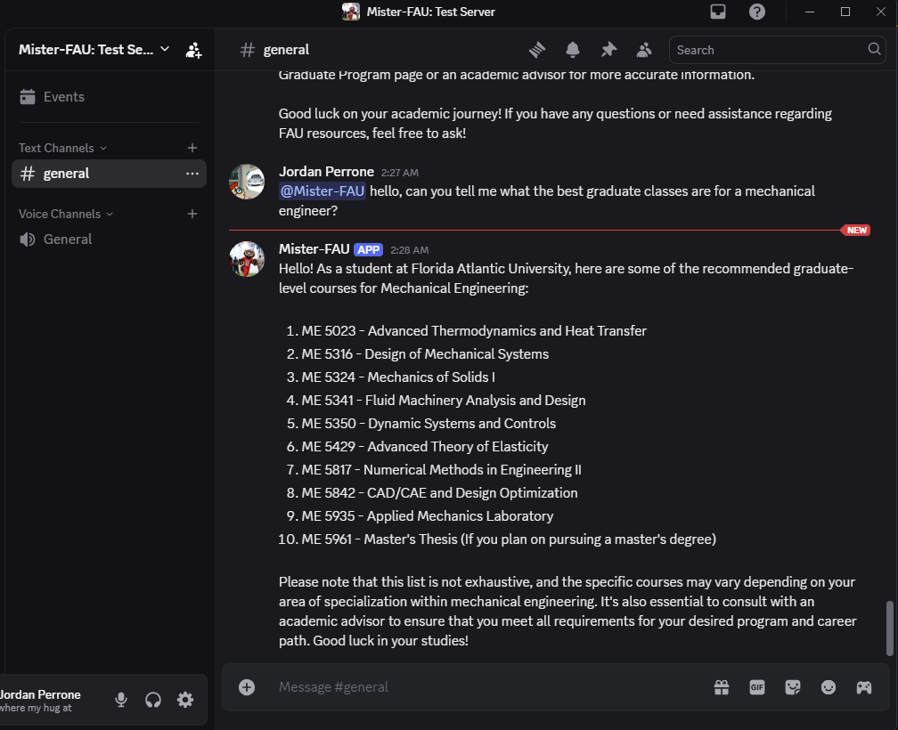

# Examples of Bot Operation in Discord

##### Testing with high temp, 2048k context
    temp = 1
    context_window = 2048
    output_window = 2048

###### Message: 
hello, can you tell me what the best graduate classes are for a mechanical engineer?

###### Response:
Hello! As a student seeking a Mechanical Engineering graduate program at Florida Atlantic University (FAU), here are some popular courses that might be beneficial for your academic journey:

ME 5602 - Advanced Thermodynamics
ME 5634 - Computational Fluid Dynamics
ME 5703 - Control Systems Theory and Design
ME 5724 - Robotics
ME 5811 - Material Science for Mechanical Engineers
ME 5931 - Optimization Methods in Engineering
ME 5932 - Advanced Manufacturing Processes
ME 5941 - Finite Element Analysis
ME 5942 - Applied Numerical Methods

These courses offer a mix of advanced engineering topics, such as computational fluid dynamics, control systems, and materials science, along with specialized areas like robotics, optimization, manufacturing processes, and numerical methods. Keep in mind that your specific program requirements might vary, so I recommend consulting the FAU Mechanical Engineering Graduate Program page or an academic advisor for more accurate information.

Good luck on your academic journey! If you have any questions or need assistance regarding FAU resources, feel free to ask!

#### Testing with low temp, 2048k context

    temp = 0.1
    context_window = 2048
    output_window = 2048
###### Message: 
hello, can you tell me what the best graduate classes are for a mechanical engineer?

###### Response:
Hello! As a student at Florida Atlantic University, here are some of the recommended graduate-level courses for Mechanical Engineering:

ME 5023 - Advanced Thermodynamics and Heat Transfer
ME 5316 - Design of Mechanical Systems
ME 5324 - Mechanics of Solids I
ME 5341 - Fluid Machinery Analysis and Design
ME 5350 - Dynamic Systems and Controls
ME 5429 - Advanced Theory of Elasticity
ME 5817 - Numerical Methods in Engineering II
ME 5842 - CAD/CAE and Design Optimization
ME 5935 - Applied Mechanics Laboratory
ME 5961 - Master's Thesis (If you plan on pursuing a master's degree)

Please note that this list is not exhaustive, and the specific courses may vary depending on your area of specialization within mechanical engineering. It's also essential to consult with an academic advisor to ensure that you meet all requirements for your desired program and career path. Good luck in your studies!

